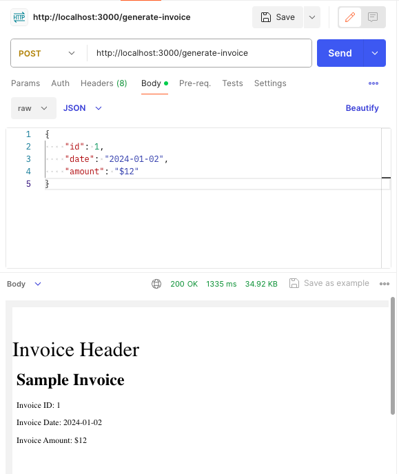

# Custom PDF Invoice Template Generator
This is a simple tool to generate custom PDF invoice based on predefined template. It uses  [ejs](https://ejs.co/) to inject the data fields and pre-render HTML files from predefined templates before using [puppeteer](https://pptr.dev/api/puppeteer.pdfoptions) to generate the PDF from the HTML. In this repository, there's a sample template that you can use to generate PDF invoice.

## Pre-requisites
- [Node.js (v20 or higher)](https://nodejs.org/en/download/)
- [npm](https://www.npmjs.com/get-npm)
- Make sure you are in the correct working directory where the `package.json` file is located.
- Run `npm install` to install all the dependencies.

## Running as an Express Application (API Server) 
1. Run `npm start` to run the application as an express application to generate PDF invoice via API call. 
2. Send a POST request (using Postman or any other tool) to `http://localhost:3000/generate-invoice` with the following JSON payload:
```
{
    "id": 1,
    "date": "2024-01-02",
    "amount": "$12"
}
```
3. You will receive a response with the generated PDF invoice.

[


## Running as a Telegram Bot application
1. Create a new bot using [BotFather](https://core.telegram.org/bots#6-botfather) and get the token.
2. Update the `.env` file with the bot token.
3. Run `npm run bot` to run the application as a Telegram bot.
4. To generate PDF invoice, send the following command to the bot:
   > The command should be in the format: `/generate <id> <date> <amount>`
5. The bot will respond with the generated PDF `invoice.pdf` as an attachment in the reply to the user.
  
[